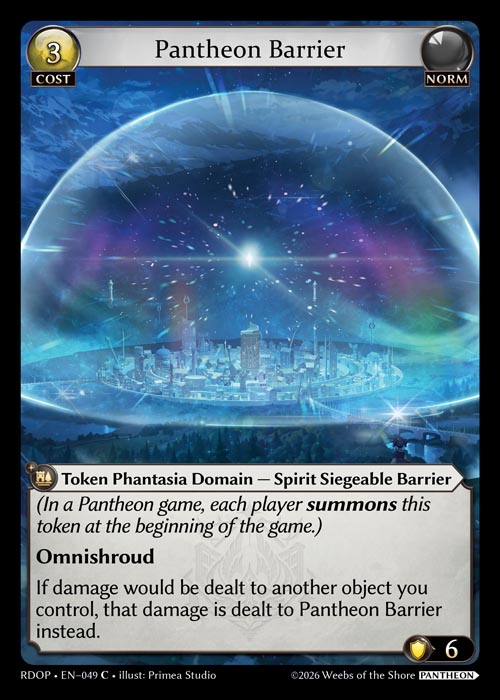

# Start of Game Procedures

#### General Rules

Prior to beginning the first game of a match, if players submit decklists, they must ensure that their starting Main Deck, Material Deck, and Sideboard in the first game of each match exactly match the lists on the submitted decklists. For tournaments that do not require submitted deck lists, players must ensure that their starting Main Deck, Material Deck, and Sideboard exactly match the Main Deck, Material Deck, and Sideboard used for the first game of the first match of the tournament.

Once players are seated and ready to begin a game of a match, players proceed through the following steps:

1. Players place their Material deck in the appropriate zones and set their Sideboard off to the side, away from the play area.
2. Players shuffle their own Main Decks to ensure that it is sufficiently randomized.
3. Players present their Main Decks to their opponents to shuffle/cut.
4. The shuffled Main Decks are placed in the appropriate zones in the play area.
5. A selected player becomes the first turn player and their opponent is the second turn player. If it is the first game of a play-off round, the player with the highest standing chooses which player becomes the first turn player. If it is the first game of a round, the selected player is randomly determined (coin toss, die roll, etc.). Player may only proceed to the next step if the round timer has been started. If players begin playing their first game before this point, it is considered a false start.
6. Each player places a Level 0 Spirit Champion in play at the same time and, in turn order, resolves the On Enter ability to decide their respective starting hand. The first turn player skips the Wake Up, Materialize, Recollection, and Draw phases and begins their Main Phase. The first player in a two-player match can't attack during their first turn.
7. The second turn player skips their Wake Up, Materialize, and Recollection phases and begins their Draw Phase. They may attack during this turn.

\
After the first game of the match, the loser of that game decides whether they wish to be the first or second turn player. That player **must** decide whether they are playing first or second before a spirit champion is placed onto the field and a starting hand is drawn, after sideboarding is complete (after decks have been presented for final cut/shuffle). However, that play **may** decide to declare whether they will play first at any point after the end of a game. If the declare a choice early, that player is expected to abide by that decision even if players are still in the process of sideboarding. If that player does not explicitly declare a choice, it is assumed that they will be the first turn player. In the case the first game ends in a draw, the first turn player of the drawn game will become the turn player of the next game.

#### Pantheon

Pantheon is a multiplayer format for Grand Archive that features 3 to 4 players within a "pod." Starting a Pantheon match beings similarly to a normal match, with a few exceptions.

1. Players place their Material deck in the appropriate zone.
2. Players in the pod shuffle their own Main Decks to ensure that it is sufficiently randomized
3. Players then present their shuffled deck to an opponent for a final shuffle/cut.
4. The shuffled Main Decks are placed in the appropriate zones in the play area.
5. Players will also place down a Lesser Boon card and a Greater Boon Card face down in their respective Pantheon Zones.
6. A selected player becomes the first turn player via random selection with each other player becoming the next player in turn order, determined in clockwise fashion.
7. All players will simultaneously reveal and play a Level 0 Spirit Champion, as well as a Pantheon Barrier. The first turn player skips the Wake Up, Materialize, Recollection, and begins the game during the Draw Phase. Other players in turn order proceed through the same modified turn order.  Only the last player in the first turn cycle may declare attacks during their first turn.


  

Pantheon Barrier is a Token Phantasia Domain with subtypes of Spirit Siegeable BArrier that is Norm with a reserve cost of 3 and a durability of 6.  It has Omnishroud and says "If damage would be dealt to another object you control, that damage is dealt to Pantheon Barrier instead.


 
