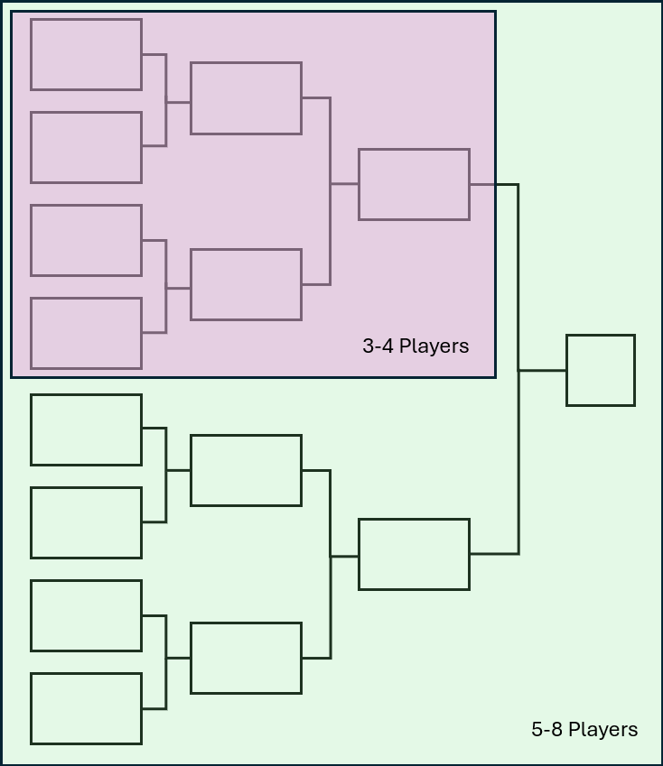

# Sanctioning Events

#### Standard and Team Standard Tournaments

Tournaments organized for Grand Archive should be hosted through the Omnidex. The Omnidex is a software that enables tournament organizers and players to host and participate in events, respectively. The Omnidex allows tournament organizers to create events, register players, create pairings, track brackets, and list player standings in the tournament. All events sanctioned through the Omnidex award players points that contribute to their player ranking within the Omnidex and among all registered players of Grand Archive.

If Omnidex is not available or is under maintenance, tournaments can also be tracked through free third-party tournament-organizer software. Such tournaments will not, however, be tracked on the Omnidex and no points can be awarded to players to contribute to player ranking.

A minimum of 8 players is recommended to run a tournament for Grand Archive. It is acknowledged that some circumstances may result in fewer than 8 players present during the first round of a tournament or during the drafting phase of a limited tournament. In such cases, tournament organizers have the discretion to continue or start a tournament with fewer players if all participating players are in agreement. Future guidelines regarding ranked or rated tournament play will require a minimum of 8 players, otherwise, it will not be considered rated.

#### Swiss Pairings

In the case of Swiss pairing tournaments, the number of rounds is based on players and can be calculated via rounding up of log2(N) where N is the number of players registered for the tournament. In this manner, a table such as the following can be generated giving recommended rounds based on players: 

<figure><figcaption>
Example Table of Attending Players and Tournament Rounds
</figcaption></figure>

Thus, a tournament will always have at least 3 rounds. Rounds should be determined before initiation of the 1st round of a tournament and the number of rounds cannot be changed any further after this, regardless of how many players choose to drop. Tournaments may be set up in such a way as to have more rounds than suggested by the above table, however, this might result in a situation where a single player will have X match wins after X rounds in a tournament announced as having an X+1 round structure. Additionally, organizers may wish to hold [top cuts](../tournament-mechanics/round-structure.md#top-cuts) to reduce player counts for a playoff of a bracket. E.g., after the Swiss rounds of a tournament have concluded, it is possible to do a play-off phase with only the top 2, 4, 8, 16, etc. players.

#### Single Elimination

In a single elimination format, players are eliminated from the tournament every round. Unlike Swiss pairings where a player's overall record is taken into consideration for placement, a player is eliminated the moment they lose a match, leaving only the undefeated players in the tournament. Typically, this method to determine placement is reserved for smaller tournaments or top cuts. Seen in the figure below, an example of a single elimination bracket is given where each step will take a winner from a match in a previous round for pairings until only one undefeated player remains. For 5-8 players, this requires 3 rounds while for 3-4 players, only 2 are necessary. Otherwise, the rounds follow the same round calculations Swiss pairings use. The most common case single elimination is used is for top cut of tournaments and final standings from a smaller group of a large tournament pool. In this way, less total games are played compared to Swiss events. Subsequent brackets can be formed from losers of matches to play for placement within that elimination tier. E.g., the 3rd-4th place players can be paired to determine position for these two spots while 1st-2nd players will play a final match to determine the overall winner.

<figure><figcaption>
Example Single-elimination Bracket to Demonstrate Rounds
</figcaption></figure>

#### Pantheon

Pantheon matches may be support at Ascent events where a single round is played to determine the winner from 4 players in a Pantheon pod.

**Examples**

Tournament round formats players, tournament organizers, and judges might expect:

* For tournaments of size 5-8 participants, expect 3 rounds for Swiss. The same is true for single elimination, although this will typically be within a top cut situation.
* Limited tournaments using a full pod of 8 players at a table can resolve standings after 3 rounds, although more may be required if players are paired between pods. Tournament Organizers may thus opt for 4 or 5 rounds with a cut to the top 8. Tournament Organizers can select different round formats based on needs, typically as a result of a store-run event where either staffing, hours, or prizing is limited.
* Refer to the table above for general recommendations, as well as the recommendations given by Omnidex when hosting an event.
* Premiere tournament for Grand Archive have specific cases where [top cuts](../tournament-mechanics/round-structure.md#top-cuts) are used. Top cuts are generally played via Single Elimination.

 
